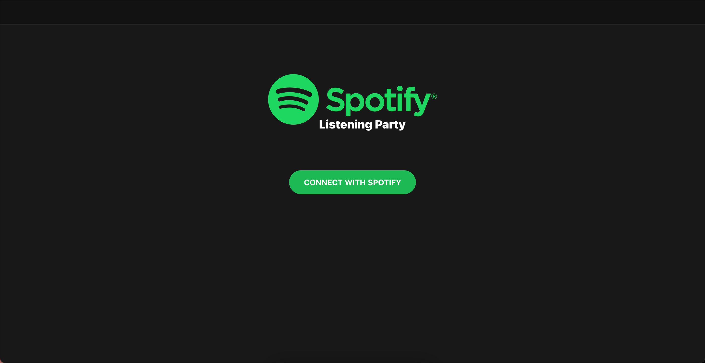
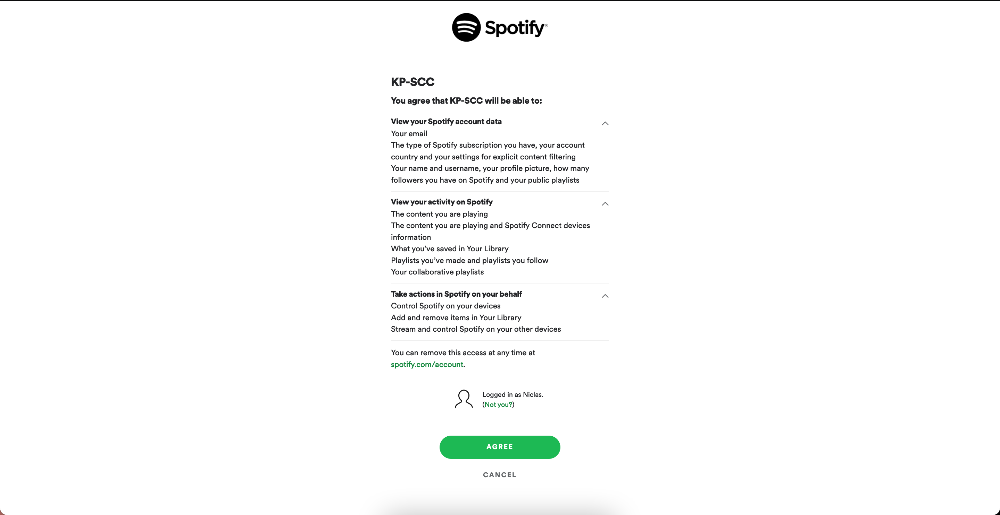
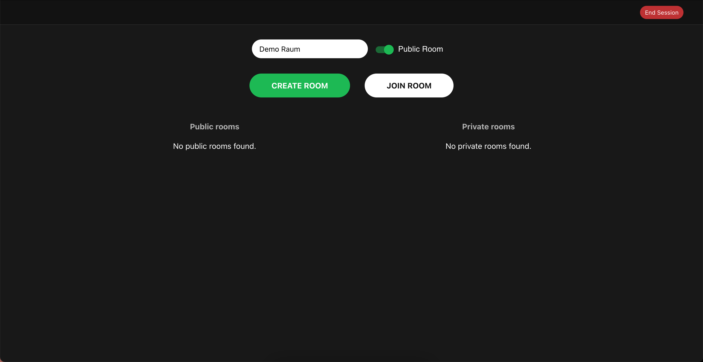
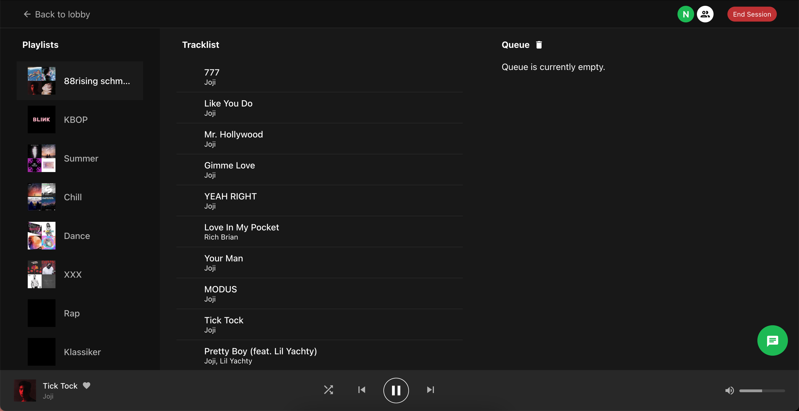
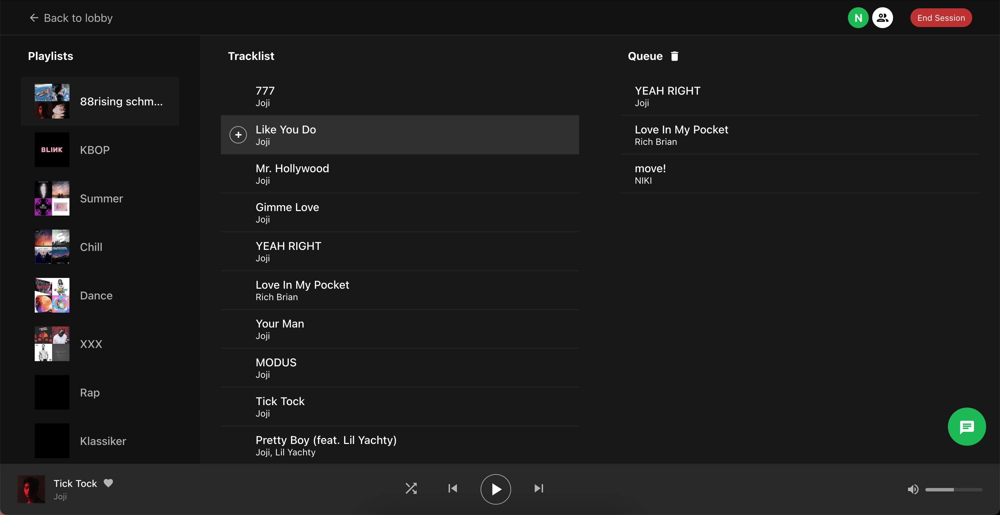
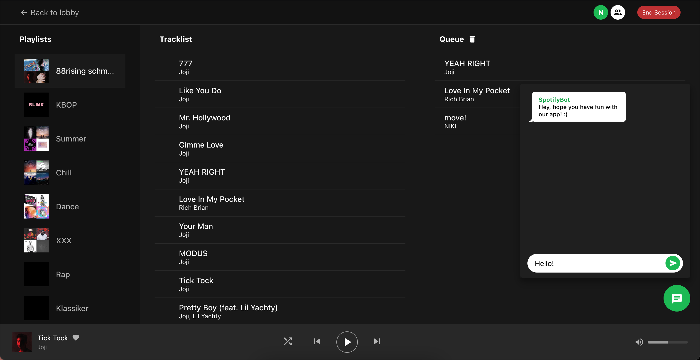
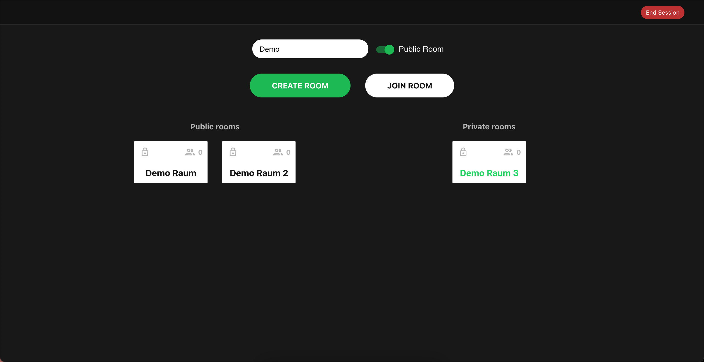
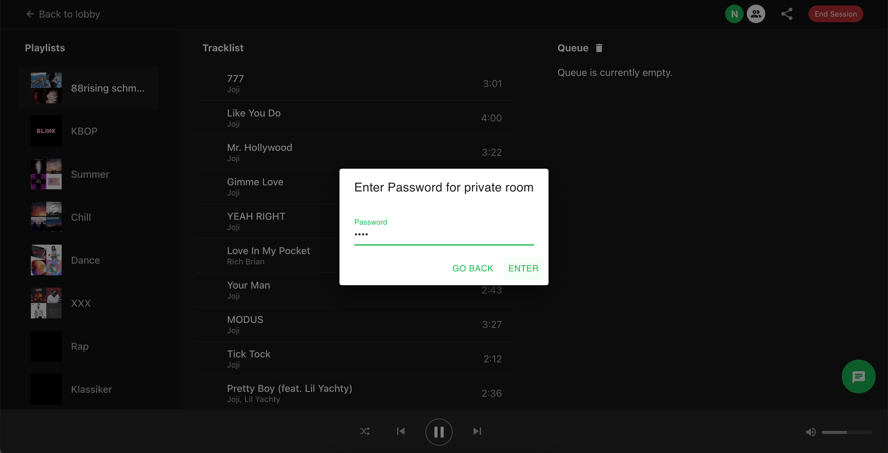
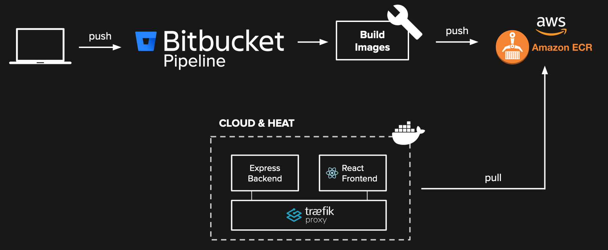

# Spotify Listening Party

Spotify Listening Party makes it possible to listen to music with friends and strangers in rooms together and synchronized via Spotify. All you need is a Spotify Premium account and a current version of Chrome or Firefox. Users can create their own public or password-protected rooms or join existing ones. In each room, there is a shared queue to which everyone can add songs from their own playlists. There is also a simple chat function for communication in the room.

## Client Usage

The following section describes the basic usage of the client.



Start off by clicking on "Connect with Spotify". You will get redirected to the Spotify Login page.



Enter your Spotify credentials or simply click on "Agree", if you are already signed in.



In the lobby you have the possibility to create rooms or join existing rooms.



In the room you have the possibility to select and play songs from your playlists. The general UI is based on the classic Spotify application.



To enable a collaborative use of the room, songs are not played directly, but first added to a queue. Songs are then played one after the other.



You are also able to chat with everyone inside the room.



To join an existing room, simply click on the room in the lobby.



You may have to enter the room password, if you choose to join a private room. The password can be set when creating the room.

## Assignment of tasks in the team:

- **Wei-Yun Chen**: Features (linking, add to playlist, ...) and Presentation
- **Cedric Partzsch**: Frontend and Backend
- **Niclas Zellerhoff**: Frontend, Backend and Infrastructure (Docker, Hosting, ...)

## Technology

The frontend is based on React and Redux and uses Spotify API endpoints (directly and via the Spotify Web SDK) to control the local player. The backend, which handles the task of room management, as well as synchronization between rooms, is a simple Node.js-based Express server. The entire system is thus JavaScript (or TypeScript in the case of the frontend) based, which allows for straightforward development of both parts. MongoDB is used for persistence, hosted via MongoDB-Atlas. The front-end and back-end communicate with each other using WebSockets (based on socket.io) to enable real-time communication.

In order to use the client website, the user must first authenticate with Spotify, which in turn returns a JWT. Otherwise, the service can be used publicly, whereas private rooms are password-protected.


## Interface description

The communication with the backend is done via WebSockets. A message has the following structure, where `msg` contains the content of the request.

```
{
  source: 'client',
  message: msg,
}
```

### room/create

Creates a new socket room.

```
{
  name: string
  roomPublic: Boolean
  roomPassword?: string
  activeListeners: string[]
  queue: WebPlaybackTrack[]
  shuffledQueue: WebPlaybackTrack[]
  shuffled: boolean
  creatorId: string
  currentTrack: CurrentTrackResponse | null
}
```

### room/join

Join an existing socket room.

```
{
  roomId: string,
  username: string,
  password: string
}
```

### room/is_private

Check if room with the provided roomId is private.

```
{
  roomId: string
}
```

### room/leave

Leave a socket room.

```
{
  username: string
}
```

### room/chat/new_message

Send a chat message.

```
{
  msg: string
  user: string
}
```

### room/queue/add_track

Add a track to the current queue

```
{
  track: WebPlayBackTrack,
  roomId: string
}
```

### room/queue/clear

Clear the current queue

```
{
  roomId: string
}
```

### room/player/toggle_play

Toggle between paused and playing state.

```
{
  paused: Boolean, roomId: String
}
```

### room/player/skip_forward

Skip to the next track.

```
{
  roomId: string
}
```

### room/get_all

Get all available rooms.

### room/player/toggle_shuffle

Toggle between shuffled mode.

```
{
  shuffled: Boolean,
  roomId: string
}
```

## Testing

The tests are performed with [Jest](https://jestjs.io/). Currently, tests for database accesses of the API are implemented. In the future the React frontend could (and should) also be tested additionally. However, since the frontend is only an exemplary implementation of the client, only the backend has been addressed so far.

To create mock MongoDBs, [mongodb-memory-server](https://github.com/nodkz/mongodb-memory-server) is used. This package spins up an actual/real MongoDB server programmatically from node, for testing or mocking during development. By default it holds the data in memory. A fresh spun up mongod process takes about 7Mb of memory.

## Deployment

Each push to the Bitbucket repository triggers a pipeline (defined in `bitbucket-pipelines.yml`) that automatically builds the Docker images and then pushes them to a public AWS ECR repository. In the production application, the necessary images can then simply be pulled and launched from there.



To start the application, the docker-compose.prod.yml is used, which also contains `Traeffic` as a reverse proxy to run both application parts on port 80. In addition, an SSL certificate for the use of https is issued with the help of Traeffic and LetsEncrypt.

## Further Development

### Prerequisites

#### Yarn

This project uses the package manager yarn. Make sure to install it on your system, e.g. via `npm install -g yarn`.

#### Docker

In order to generate reliable, fast, reproducible and deterministic deployments, we use [Docker](https://www.docker.com/). Make sure you have it installed on your system.

#### MongoDB Atlas

During development, we use MongoDB-Atlas as a cloud database. Via the CRON trigger functionality all rooms without active listeners are deleted once an hour. Use the following code snippet to replicate this behaviour:

```javascript
exports = function () {
  const collection = context.services
    .get("SERVICE_NAME")
    .db("DATABASE_NAME")
    .collection("COLLECTION_NAME");
  const query = { activeListeners: { $eq: [] } };

  collection
    .deleteMany(query)
    .then((result) => console.log(`Deleted ${result.deletedCount} item(s).`))
    .catch((err) => console.error(`Delete failed with error: ${err}`));
};
```

Replace `SERVICE_NAME`, `DATABASE_NAME` and `COLLECTION_NAME` with the corresponding values for your application.
To use the `SERVICE_NAME` you need to _Link an Atlas Data Source_ in the _MongoDB Realm_ console of your Triggers_RealmApp and then use the chosen service name instead of `SERVICE_NAME`.

#### Development Browser

For developing the application it is recommended to use Firefox, since [Chrome does not allow EME in non-secure contexts](https://groups.google.com/a/chromium.org/g/blink-dev/c/tXmKPlXsnCQ/discussion?pli=1) (ie. over HTTP). Otherwise it is not possible to initialize the Spotify-Player in the browser.

### Setup

Copy the `env.example` files in both /frontend and /api and rename them to `.env`. These already contain all necessary keys, however, some of the values have to be replaced.

To enable the database connection, add your MongoDB-URI to the api-`.env` file (e.g. from MongoDB-Atlas).

For the local development of the app it is necessary to create a Spotify-Developer-App. Head to [https://developer.spotify.com/dashboard/](https://developer.spotify.com/dashboard/) and login with your Spotify-Account.

Then click on `"Create An App"`, give it a name and description and click on `"Create"`. Now on the left side you should see your `Client ID`. Copy this id and replace the default value for `REACT_APP_CLIENT_ID` in your frontend-`.env` file.

Go back to the Spotify dashboard and click on `"Edit Settings"` inside your newly created app.

Inside the opening pop-up add `http://localhost:3000/auth` to your Redirect URIs and hit `"Save"`.

### Run the application

Building the application:

```bash
docker-compose build
```

Afterwards head to the `api` and the `frontend` folder and run the following command in each case

```bash
yarn
```

Start the whole application in development mode using

```bash
docker-compose up -d
```

Stop the application using

```bash
docker-compose down
```
